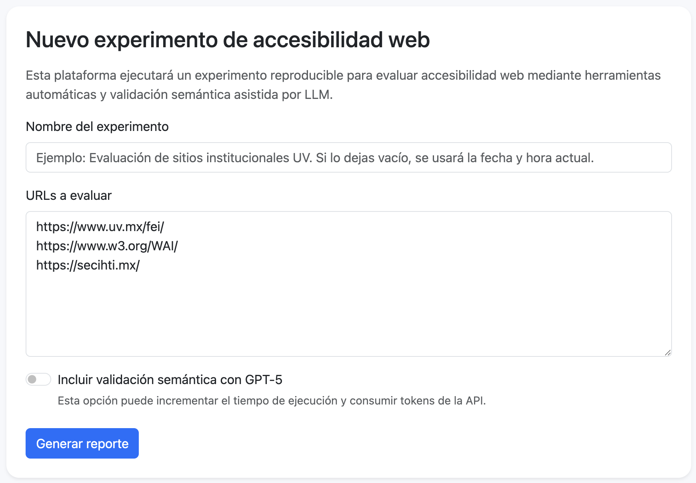
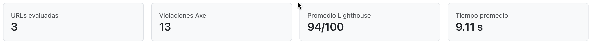

# Accessibility Docker Platform

Infraestructura experimental contenerizada para la evaluación revaluación automática y semántica de accesibilidad web utilizando Docker, Axe-Core, Lighthouse y GPT-5.


## 1. Descripción general

Accessibility Docker Platform es una plataforma experimental que permite a investigadores ejecutar evaluaciones reproducibles de accesibilidad web mediante una infraestructura completamente contenerizada.

La plataforma permite registrar experimentos, evaluar una o varias URLs, generar reportes, visualizar gráficas y descargar evidencias en CSV y JSON.

La plataforma integra las siguientes herramientas:

- Axe-Core
- Google Lighthouse
- Chromium
- GPT-5 (análisis semántico opcional)
- MySQL
- Flask
- Docker Compose

Todas las dependencias de software se encuentran incluidas dentro de imágenes Docker publicadas en Docker Hub. El equipo anfitrión únicamente requiere tener Docker instalado.

## 1.1 Proyecto final: Repetibilidad y observables

**Usuario de GitHub:** `gverafei`

**Usuario de Docker Hub:** `gverafei`

### Hipótesis

**H1.** Una infraestructura contenerizada permite realizar evaluaciones automáticas de accesibilidad web de forma repetible, produciendo métricas consistentes de accesibilidad (Axe-Core y Lighthouse) y tiempos de ejecución con baja variabilidad cuando el mismo conjunto de sitios web se analiza bajo las mismas condiciones, facilitando la realización de estudios experimentales en este dominio.

### Protocolo experimental

Se ejecutará **30 veces** el mismo experimento utilizando la infraestructura Docker sin modificar la configuración del sistema.

**URLs evaluadas:**

Coloque en el cuadro de texto las siguientes URLs como lo muestra la Figura.

* [https://www.uv.mx/fei/](https://www.uv.mx/fei/)
* [https://www.w3.org/WAI/](https://www.w3.org/WAI/)
* [https://secihti.mx/](https://secihti.mx/)

> **Importante**: Por ahora, **NO** seleccione la opción: `Incluir validación semántica con GPT-5`.



Finalmente, presione el botón `Generar reporte`.

**Variables analizadas:**

1. Tiempo promedio de ejecución.
2. Número total de violaciones detectadas por Axe-Core.
3. Puntaje promedio de accesibilidad obtenido mediante Lighthouse.

Los cantidades de cada métrica, pueden ser consultadas en el reporte generado en cada ejecucción.



Para cada variable se calcularán:

* Media.
* Desviación estándar.
* Coeficiente de variación (CV).

Además, se observarán las correlaciones generadas automáticamente por la plataforma entre las principales métricas del experimento.

### Instrucciones para los demás evaluadores

Repitan el experimento **30 veces** utilizando las mismas tres URL y la misma configuración de la plataforma. Calculen las tres métricas anteriores (media, desviación estándar y CV) y publiquen sus resultados en este mismo hilo, indicando también las correlaciones obtenidas y cualquier diferencia observada respecto a mis resultados.

### Criterio de evaluación

Se considerará que el experimento presenta una alta repetibilidad si las métricas obtenidas muestran un **coeficiente de variación bajo**, indicando una variabilidad mínima entre ejecuciones bajo las mismas condiciones experimentales.

### Entorno de ejecución

<small>

| Característica | Valor |
|----------------|-------|
| Equipo | Apple MacBook Air M4 |
| Arquitectura | ARM64 (Apple Silicon) |
| Sistema operativo | macOS |
| Versión del sistema operativo | 26.5.1 |
| Memoria RAM | 16 GB |
| CPU | Apple M4 |
| GPU | GPU integrada Apple M4 |
| Versión de Docker | 29.6.1 |
| Versión de Docker Compose | 5.3.0 |

</small>

### Resultados

<small>

| Iteración | Tiempo (s) | Violaciones Axe | Lighthouse | Observaciones |
|-----------:|-----------:|----------------:|------------:|---------------|
| 1  | 12.04 | 23 | 87.33 | - |
| 2  | 12.16 | 23 | 87.33 | - |
| 3  | 12.20 | 23 | 87.33 | - |
| 4  | 11.99 | 23 | 87.33 | - |
| 5  | 12.34 | 23 | 87.33 | - |
| 6  | 12.31 | 23 | 87.33 | - |
| 7  | 12.06 | 23 | 87.33 | - |
| 8  | 12.05 | 23 | 87.33 | - |
| 9  | 12.06 | 23 | 87.33 | - |
| 10 | 12.08 | 23 | 87.33 | - |
| 11 | 12.25 | 23 | 87.33 | - |
| 12 | 12.28 | 23 | 87.33 | - |
| 13 | 12.19 | 23 | 87.33 | - |
| 14 | 11.87 | 23 | 87.33 | - |
| 15 | 12.40 | 23 | 87.33 | - |
| 16 | 11.95 | 23 | 87.33 | - |
| 17 | 14.02 | 23 | 87.33 | - |
| 18 | 12.16 | 23 | 87.33 | - |
| 19 | 12.44 | 23 | 87.33 | - |
| 20 | 11.97 | 23 | 87.33 | - |
| 21 | 12.30 | 23 | 87.33 | - |
| 22 | 12.21 | 23 | 87.33 | - |
| 23 | 12.80 | 23 | 87.33 | - |
| 24 | 12.29 | 23 | 87.33 | - |
| 25 | 12.12 | 23 | 87.33 | - |
| 26 | 12.06 | 23 | 87.33 | - |
| 27 | 12.47 | 23 | 87.33 | - |
| 28 | 12.66 | 23 | 87.33 | - |
| 29 | 12.20 | 23 | 87.33 | - |
| 30 | 12.31 | 23 | 87.33 | - |

</small>

<small>

| Métrica                 |   Media   | Desviación estándar | Coeficiente de variación (CV) |
| ----------------------- | --------: | ------------------: | ----------------------------: |
| Tiempo de ejecución (s) | **12.27** |            **0.39** |                    **3.16 %** |
| Violaciones Axe         | **23.00** |            **0.00** |                    **0.00 %** |
| Lighthouse              | **87.33** |            **0.00** |                    **0.00 %** |

</small>

### Conclusiones

La hipótesis **H1** fue aceptada.

Durante las treinta ejecuciones no se presentaron fallos de conectividad, bloqueos por parte de los sitios web evaluados ni cambios en el contenido de las páginas, lo que permitió mantener constantes las condiciones del experimento. Asimismo, las métricas reportadas por Axe-Core y Lighthouse permanecieron invariables debido a que ambas herramientas implementan algoritmos determinísticos basados en reglas de evaluación y criterios definidos por los estándares WCAG. Bajo una misma versión del software, el mismo navegador y el mismo contenido HTML, es esperable que produzcan exactamente los mismos resultados.

Sin embargo, este comportamiento podría ser diferente al incorporar un modelo de lenguaje como GPT-5 para realizar el análisis semántico. A diferencia de Axe-Core y Lighthouse, los modelos de lenguaje están basados en aprendizaje automático y procesos probabilísticos, por lo que sus respuestas pueden presentar cierta variabilidad entre ejecuciones, incluso cuando la entrada permanece sin cambios. En consecuencia, en la siguiente observación de replicabilidad, se debería analizar la estabilidad de los hallazgos generados por el LLM, permitiendo comparar el comportamiento de herramientas determinísticas frente a sistemas basados en inteligencia artificial generativa. De esta manera, sería posible caracterizar con mayor precisión el grado de repetibilidad alcanzable por cada tipo de tecnología dentro de una infraestructura experimental para la evaluación de accesibilidad web.

## 2. Requisitos

Antes de ejecutar el proyecto se requiere tener instalado:

- Docker
- Docker Compose
- Conexión a Internet

> Docker Compose ya se encuentra incluido en Docker Desktop.

Opcionalmente, para usar la validación semántica:

- API key de OpenAI

## 3. Estructura del proyecto

La infraestructura utiliza Docker Compose para ejecutar tres servicios:

- `web`: aplicación Flask con interfaz web.
- `evaluator`: servicio Node.js/Python con Axe, Lighthouse, Chromium y GPT-5.
- `db`: base de datos MySQL 8.

```text
accessibility-docker-platform/
│
├── docker-compose.yml
├── .env.example
├── README.md
│
├── web/
│   ├── Dockerfile
│   ├── requirements.txt
│   └── app/
│
├── evaluator/
│   ├── Dockerfile
│   ├── package.json
│   ├── requirements.txt
│   ├── server.js
│   ├── run_axe.js
│   ├── run_lighthouse.js
│   └── semantic_review.py
│
├── data/
│   └── default_urls.txt
│
└── results/
    ├── raw/
```

La plataforma se distribuye mediante dos imágenes Docker publicadas en Docker Hub:

```text
gverafei/accessibility-web

gverafei/accessibility-evaluator
```

## 4. Instalación

### Clonar el repositorio

```bash
git clone https://github.com/gverafei/accessibility-docker-platform.git

cd accessibility-docker-platform
```

### Crear el archivo de configuración

```bash
cp env.example .env
```

### Configurar GPT-5 (opcional)

Si se desea realizar el análisis semántico mediante GPT, edite el archivo `.env` e incluya su llave de acceso o seleccione otro modelo de OPEN AI:

```env
OPENAI_API_KEY=coloca_aqui_tu_api_key
OPENAI_MODEL=gpt-5
```

Si no se configura la API key, la plataforma puede ejecutarse sin validación semántica.

## 5. Ejecución

Únicamente necesita iniciar la plataforma mediante:

```bash
docker compose up
```

Durante la primera ejecución Docker descargará automáticamente las imágenes publicadas en Docker Hub.

### Construcción desde el código fuente

Si desea construir y levantar los contenedores desde el código fuente sin utilizar las imágenes de Docker Hub, utilice:

```bash
docker compose -f docker-compose-dev.yml up --build
```

### Abrir la plataforma

Una vez finalizado el proceso, abra su navegador y acceda a:

```text
http://localhost
```

### Reinicio limpio

Si se requiere borrar todos los experimentos realizados, ejecute:

```bash
# Para inicio usando imágenes
docker compose down -v --remove-orphans

# Para construcción mediante código fuente
docker compose -f docker-compose-dev.yml down -v --remove-orphans
```

Este comando elimina los volúmenes, incluida la base de datos.

## 6. Uso de la plataforma

### Paso 1. Abrir la aplicación

Abrir `http://localhost`.

Al iniciar la plataforma se mostrará la página principal.


---

### Paso 2. Crear un nuevo experimento

Introduzca una o varias URL (una por línea).

Si el cuadro de texto se deja vacío, la plataforma utilizará automáticamente el conjunto de sitios de prueba incluido en el proyecto en el archivo:

```text
data/default_urls.txt
```


### Paso 3. Habilitar el análisis semántico (opcional)

Active la opción de análisis semántico mediante GPT-5.

Esta funcionalidad realiza una inspección adicional enfocada en aspectos semánticos de accesibilidad que normalmente no son detectados por herramientas automáticas tradicionales.


### Paso 4. Generar el reporte

Presione el botón:

> **Generar reporte**

Mientras se ejecuta el experimento se mostrará una barra de progreso indicando el estado de procesamiento.


### Paso 5. Consultar los resultados

Al finalizar el experimento se mostrará un reporte interactivo con:

- Violaciones detectadas por Axe-Core.
- Puntaje de accesibilidad obtenido por Lighthouse.
- Hallazgos del análisis semántico mediante GPT-5.
- Métricas estructurales del documento HTML.
- Información del entorno experimental.
- Estadísticas descriptivas.
- Gráficas interactivas.


### Paso 6. Descargar las evidencias

La plataforma permite descargar:

- Dataset consolidado (CSV)
- Resultados de Axe-Core (JSON)
- Resultados de Lighthouse (JSON)
- Resultados del análisis semántico (JSON)

Estos archivos permiten conservar las evidencias originales del experimento y facilitan su reproducción posterior.


##  7. Resultados generados

Cada experimento registra automáticamente:

- Versión de Python
- Versión de Node.js
- Versión de Chromium
- Versión de Axe-Core
- Versión de Lighthouse
- Modelo GPT utilizado
- Versión de las imágenes Docker
- URLs evaluadas.
- Resultados de Axe.
- Resultados de Lighthouse.
- Resultados semánticos de GPT-5 (opcional).
- Métricas estructurales del HTML.
- Información del entorno experimental.
- Tiempo de ejecución.
- Evidencias crudas en formato JSON.
- Dataset consolidado en formato CSV.

Esta información permite reproducir posteriormente el experimento bajo condiciones equivalentes.


## 8. Evidencias descargables

Desde el reporte del experimento se pueden descargar:

- CSV consolidado del experimento.
- JSON crudo de Axe.
- JSON crudo de Lighthouse.
- JSON crudo de GPT-5 (cuando aplique).

Estos archivos permiten conservar las evidencias originales del experimento y facilitan su reproducción posterior.

Adicionalmente estos archivos se almacenan dentro del directorio:

```text
results/
```

## 9. Servicios Docker

La infraestructura está compuesta por tres servicios:

```text
web        Flask + Jinja2 + Bootstrap 5
evaluator  Node.js + Chromium + Axe + Lighthouse + Python + GPT-5
db         MySQL 8
```

El servicio `web` se publica en el puerto 80 del equipo anfitrión, por lo que la aplicación se abre directamente desde:

```text
http://localhost
```

## 10. Reproducibilidad

La plataforma registra automáticamente el entorno experimental utilizado en cada ejecución:

- Versión de Python.
- Versión de Node.js.
- Versión de Chromium.
- Versión de Axe Playwright.
- Versión de Lighthouse.
- Modelo LLM configurado.
- Tiempo total de ejecución.

Esto permite documentar las condiciones bajo las cuales se ejecutó cada experimento y facilita su reproducción por otros investigadores.

## 11. Publicación de imágenes en Docker Hub

La plataforma se distribuye mediante dos imágenes Docker publicadas en Docker Hub:

```text
gverafei/accessibility-web

gverafei/accessibility-evaluator
```

### Proceso de construcción

A continuación se describe el proceso de construcción de las imágenes:

```bash
docker build --platform linux/amd64,linux/arm64 -t gverafei/accessibility-web ./web
docker build --platform linux/amd64,linux/arm64 -t gverafei/accessibility-evaluator ./evaluator
```

Posteriormente podrán publicarse mediante:

```bash
docker push gverafei/accessibility-web
docker push gverafei/accessibility-evaluator
```

Para verificar que tienen soporte de multi-arquitectura:

```bash
docker buildx imagetools inspect gverafei/accessibility-web
docker buildx imagetools inspect gverafei/accessibility-evaluator
```

Debe aparecer dos campos Platform con linux/amd64 y linux/arm64

De esta forma, se podrá ejecutar la plataforma descargando únicamente las imágenes desde Docker Hub, sin necesidad de reconstruir el proyecto.

# Licencia

MIT License