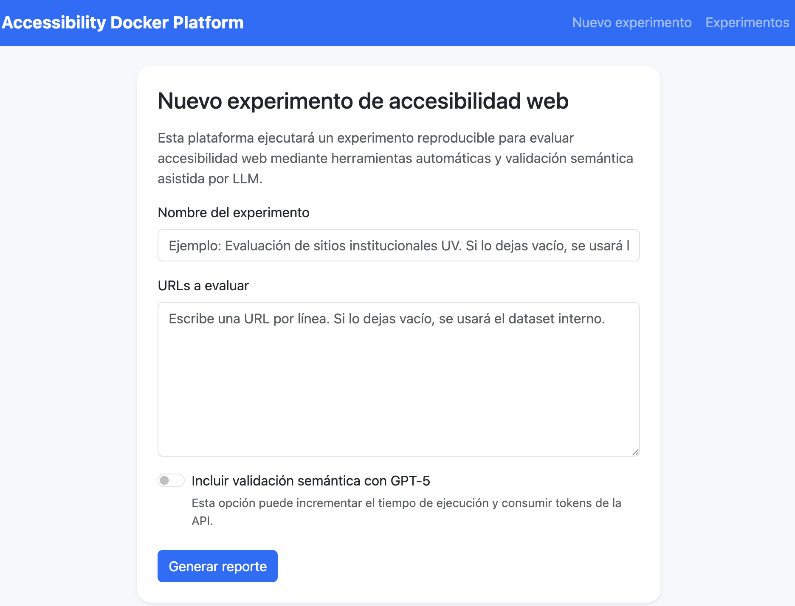
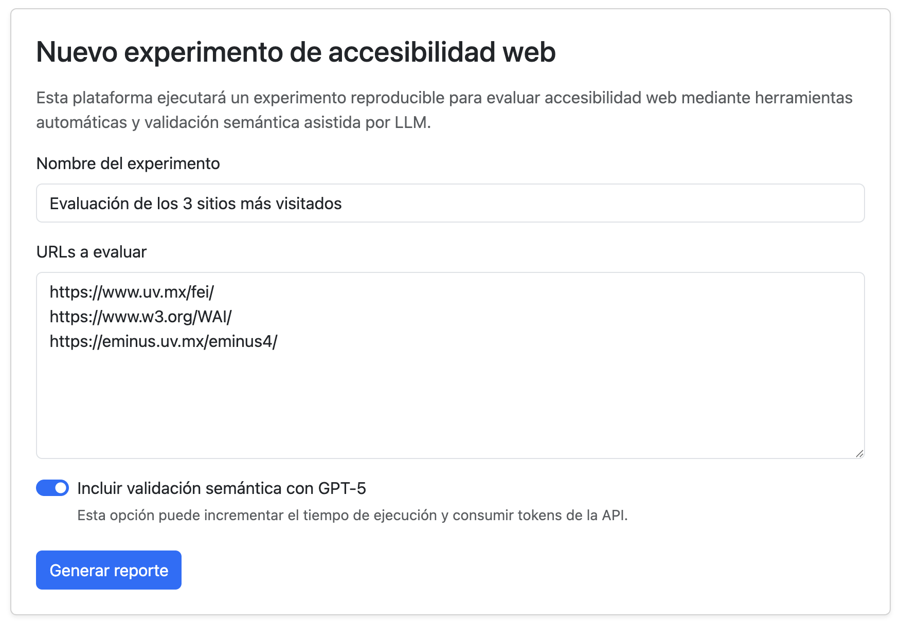
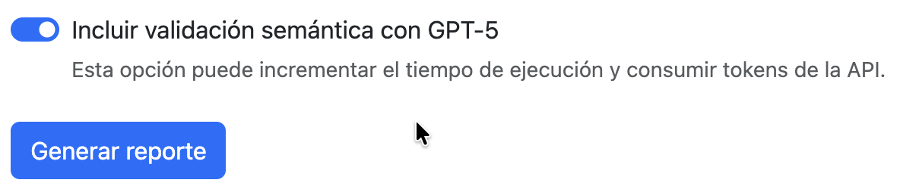
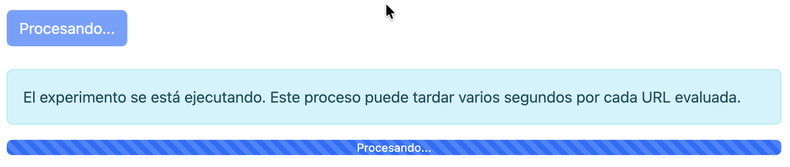
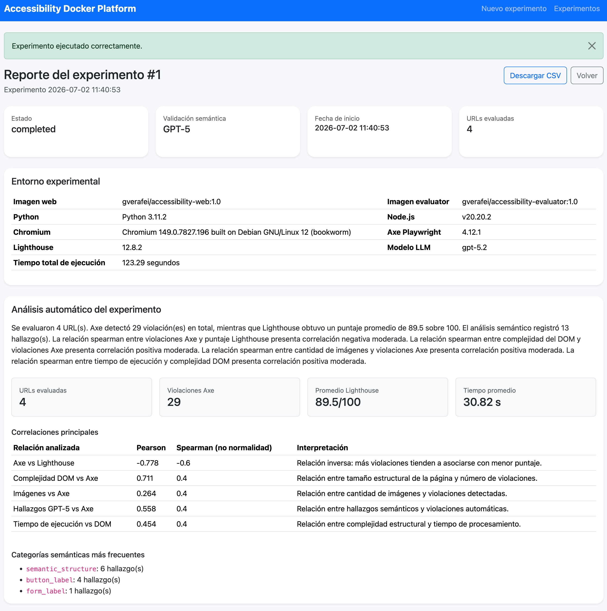
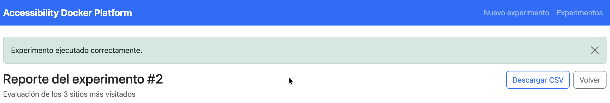
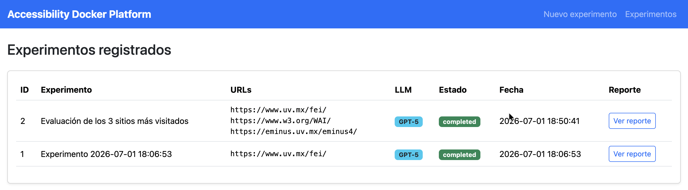

# Accessibility Docker Platform

Infraestructura experimental contenerizada para la evaluación revaluación automática y semántica de accesibilidad web utilizando Docker, Axe-Core, Lighthouse y GPT-5.


## 1. Descripción general

Accessibility Docker Platform es una plataforma experimental que permite a investigadores ejecutar evaluaciones reproducibles de accesibilidad web mediante una infraestructura completamente contenerizada.

La plataforma permite registrar experimentos, evaluar una o varias URLs, generar reportes, visualizar gráficas y descargar evidencias en CSV y JSON.

La plataforma integra las siguientes herramientas:

- Axe-Core
- Google Lighthouse
- Chromium
- GPT-5 (análisis semántico opcional)
- MySQL
- Flask
- Docker Compose

Todas las dependencias de software se encuentran incluidas dentro de imágenes Docker publicadas en Docker Hub. El equipo anfitrión únicamente requiere tener Docker instalado.

## 2. Requisitos

Antes de ejecutar el proyecto se requiere tener instalado:

- Docker
- Docker Compose
- Conexión a Internet

> Docker Compose ya se encuentra incluido en Docker Desktop.

Opcionalmente, para usar la validación semántica:

- API key de OpenAI

## 3. Estructura del proyecto

La infraestructura utiliza Docker Compose para ejecutar tres servicios:

- `web`: aplicación Flask con interfaz web.
- `evaluator`: servicio Node.js/Python con Axe, Lighthouse, Chromium y GPT-5.
- `db`: base de datos MySQL 8.

```text
accessibility-docker-platform/
│
├── docker-compose.yml
├── .env.example
├── README.md
│
├── web/
│   ├── Dockerfile
│   ├── requirements.txt
│   └── app/
│
├── evaluator/
│   ├── Dockerfile
│   ├── package.json
│   ├── requirements.txt
│   ├── server.js
│   ├── run_axe.js
│   ├── run_lighthouse.js
│   └── semantic_review.py
│
├── data/
│   └── default_urls.txt
│
└── results/
    ├── raw/
```

La plataforma se distribuye mediante dos imágenes Docker publicadas en Docker Hub:

```text
gverafei/accessibility-web

gverafei/accessibility-evaluator
```

## 4. Instalación

### Clonar el repositorio

```bash
git clone https://github.com/gverafei/accessibility-docker-platform.git

cd accessibility-docker-platform
```

### Crear el archivo de configuración

```bash
cp env.example .env
```

### Configurar GPT-5 (opcional)

Si se desea realizar el análisis semántico mediante GPT, edite el archivo `.env` e incluya su llave de acceso o seleccione otro modelo de OPEN AI:

```env
OPENAI_API_KEY=coloca_aqui_tu_api_key
OPENAI_MODEL=gpt-5
```

Si no se configura la API key, la plataforma puede ejecutarse sin validación semántica.

## 5. Ejecución

Únicamente necesita iniciar la plataforma mediante:

```bash
docker compose up
```

Durante la primera ejecución Docker descargará automáticamente las imágenes publicadas en Docker Hub.

### Construcción desde el código fuente


Si desea construir y levantar los contenedores desde el código fuente sin utilizar las imágenes de Docker Hub, utilice:

```bash
docker compose up -f docker-compose-dev.yml --build
```

### Abrir la plataforma

Una vez finalizado el proceso, abra su navegador y acceda a:

```text
http://localhost
```

### Reinicio limpio

Si se requiere borrar todos los experimentos realizados, ejecute:

```bash
docker compose down -v --remove-orphans
docker compose up --build
```

Este comando elimina los volúmenes, incluida la base de datos.

## 6. Uso de la plataforma

### Paso 1. Abrir la aplicación

Abrir `http://localhost`.

Al iniciar la plataforma se mostrará la página principal.



---

### Paso 2. Crear un nuevo experimento

Introduzca una o varias URL (una por línea).

Si el cuadro de texto se deja vacío, la plataforma utilizará automáticamente el conjunto de sitios de prueba incluido en el proyecto en el archivo:

```text
data/default_urls.txt
```



### Paso 3. Habilitar el análisis semántico (opcional)

Active la opción de análisis semántico mediante GPT-5.

Esta funcionalidad realiza una inspección adicional enfocada en aspectos semánticos de accesibilidad que normalmente no son detectados por herramientas automáticas tradicionales.



### Paso 4. Generar el reporte

Presione el botón:

> **Generar reporte**

Mientras se ejecuta el experimento se mostrará una barra de progreso indicando el estado de procesamiento.



### Paso 5. Consultar los resultados

Al finalizar el experimento se mostrará un reporte interactivo con:

- Violaciones detectadas por Axe-Core.
- Puntaje de accesibilidad obtenido por Lighthouse.
- Hallazgos del análisis semántico mediante GPT-5.
- Métricas estructurales del documento HTML.
- Información del entorno experimental.
- Estadísticas descriptivas.
- Gráficas interactivas.



### Paso 6. Descargar las evidencias

La plataforma permite descargar:

- Dataset consolidado (CSV)
- Resultados de Axe-Core (JSON)
- Resultados de Lighthouse (JSON)
- Resultados del análisis semántico (JSON)

Estos archivos permiten conservar las evidencias originales del experimento y facilitan su reproducción posterior.



##  7. Resultados generados

Cada experimento registra automáticamente:

- Versión de Python
- Versión de Node.js
- Versión de Chromium
- Versión de Axe-Core
- Versión de Lighthouse
- Modelo GPT utilizado
- Versión de las imágenes Docker
- URLs evaluadas.
- Resultados de Axe.
- Resultados de Lighthouse.
- Resultados semánticos de GPT-5 (opcional).
- Métricas estructurales del HTML.
- Información del entorno experimental.
- Tiempo de ejecución.
- Evidencias crudas en formato JSON.
- Dataset consolidado en formato CSV.

Esta información permite reproducir posteriormente el experimento bajo condiciones equivalentes.



## 8. Evidencias descargables

Desde el reporte del experimento se pueden descargar:

- CSV consolidado del experimento.
- JSON crudo de Axe.
- JSON crudo de Lighthouse.
- JSON crudo de GPT-5 (cuando aplique).

Estos archivos permiten conservar las evidencias originales del experimento y facilitan su reproducción posterior.

Adicionalmente estos archivos se almacenan dentro del directorio:

```text
results/
```

## 9. Servicios Docker

La infraestructura está compuesta por tres servicios:

```text
web        Flask + Jinja2 + Bootstrap 5
evaluator  Node.js + Chromium + Axe + Lighthouse + Python + GPT-5
db         MySQL 8
```

El servicio `web` se publica en el puerto 80 del equipo anfitrión, por lo que la aplicación se abre directamente desde:

```text
http://localhost
```

## 10. Reproducibilidad

La plataforma registra automáticamente el entorno experimental utilizado en cada ejecución:

- Versión de Python.
- Versión de Node.js.
- Versión de Chromium.
- Versión de Axe Playwright.
- Versión de Lighthouse.
- Modelo LLM configurado.
- Tiempo total de ejecución.

Esto permite documentar las condiciones bajo las cuales se ejecutó cada experimento y facilita su reproducción por otros investigadores.

## 11. Publicación de imágenes en Docker Hub

La plataforma se distribuye mediante dos imágenes Docker publicadas en Docker Hub:

```text
gverafei/accessibility-web

gverafei/accessibility-evaluator
```

### Proceso de construcción

A continuación se describe el proceso de construcción de las imágenes:

```bash
docker build --platform linux/amd64,linux/arm64 -t gverafei/accessibility-web ./web
docker build --platform linux/amd64,linux/arm64 -t gverafei/accessibility-evaluator ./evaluator
```

Posteriormente podrán publicarse mediante:

```bash
docker push gverafei/accessibility-web
docker push gverafei/accessibility-evaluator
```

Para verificar que tienen soporte de multi-arquitectura:

```bash
docker buildx imagetools inspect gverafei/accessibility-web
docker buildx imagetools inspect gverafei/accessibility-evaluator
```

Debe aparecer dos campos Platform con linux/amd64 y linux/arm64

De esta forma, se podrá ejecutar la plataforma descargando únicamente las imágenes desde Docker Hub, sin necesidad de reconstruir el proyecto.

# Licencia

MIT License