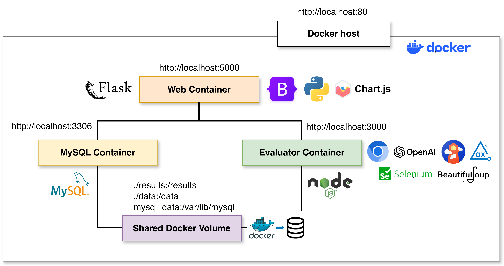

# Accessibility Docker Platform

Infraestructura experimental contenerizada para la evaluación reproducible de accesibilidad web mediante Axe, Lighthouse y validación semántica opcional con GPT-5.



## 1. Descripción

Este proyecto permite ejecutar experimentos de evaluación de accesibilidad web desde una plataforma desarrollada en Flask. La infraestructura utiliza Docker Compose para ejecutar tres servicios:

- `web`: aplicación Flask con interfaz web.
- `evaluator`: servicio Node.js/Python con Axe, Lighthouse, Chromium y GPT-5.
- `db`: base de datos MySQL 8.

La plataforma permite registrar experimentos, evaluar una o varias URLs, generar reportes, visualizar gráficas y descargar evidencias en CSV y JSON.

## 2. Requisitos

Antes de ejecutar el proyecto se requiere tener instalado:

- Docker
- Docker Compose
- Conexión a Internet

Opcionalmente, para usar la validación semántica:

- API key de OpenAI

## 3. Estructura del proyecto

```text
accessibility-docker-platform/
│
├── docker-compose.yml
├── .env.example
├── README.md
│
├── web/
│   ├── Dockerfile
│   ├── requirements.txt
│   └── app/
│
├── evaluator/
│   ├── Dockerfile
│   ├── package.json
│   ├── requirements.txt
│   ├── server.js
│   ├── run_axe.js
│   ├── run_lighthouse.js
│   └── semantic_review.py
│
├── data/
│   └── default_urls.txt
│
└── results/
    ├── raw/
    ├── reports/
    └── charts/
```

## 4. Configuración

Copiar el archivo de ejemplo:

```bash
cp env.example .env
```

Editar `.env` si se desea usar GPT-5:

```env
OPENAI_API_KEY=coloca_aqui_tu_api_key
OPENAI_MODEL=gpt-5
APP_TIMEZONE=America/Mexico_City
```

Si no se configura la API key, la plataforma puede ejecutarse sin validación semántica.

## 5. Ejecución

Construir y levantar los contenedores:

```bash
docker compose up --build
```

Abrir en el navegador:

```text
http://localhost
```

## 6. Reinicio limpio

Si se modifican tablas de MySQL o se requiere borrar todos los experimentos:

```bash
docker compose down -v --remove-orphans
docker compose up --build
```

Este comando elimina los volúmenes, incluida la base de datos.

## 7. Uso de la plataforma

1. Abrir `http://localhost`.
2. Capturar un nombre para el experimento.
3. Escribir una o varias URLs, una por línea.
4. Activar opcionalmente la validación semántica con GPT-5.
5. Presionar **Generar reporte**.
6. Consultar el reporte generado.

Si no se escriben URLs, se utilizará el archivo:

```text
data/default_urls.txt
```

## 8. Resultados generados

Cada experimento almacena:

- URLs evaluadas.
- Resultados de Axe.
- Resultados de Lighthouse.
- Resultados semánticos de GPT-5 (opcional).
- Métricas estructurales del HTML.
- Información del entorno experimental.
- Tiempo de ejecución.
- Evidencias crudas en formato JSON.
- Dataset consolidado en formato CSV.

## 9. Evidencias descargables

Desde el reporte del experimento se pueden descargar:

- CSV consolidado del experimento.
- JSON crudo de Axe.
- JSON crudo de Lighthouse.
- JSON crudo de GPT-5 (cuando aplique).

## 10. Servicios Docker

La infraestructura está compuesta por tres servicios:

```text
web        Flask + Jinja2 + Bootstrap 5
evaluator  Node.js + Chromium + Axe + Lighthouse + Python + GPT-5
db         MySQL 8
```

El servicio `web` se publica en el puerto 80 del equipo anfitrión, por lo que la aplicación se abre directamente desde:

```text
http://localhost
```

## 11. Reproducibilidad

La plataforma registra automáticamente el entorno experimental utilizado en cada ejecución:

- Versión de Python.
- Versión de Node.js.
- Versión de Chromium.
- Versión de Axe Playwright.
- Versión de Lighthouse.
- Modelo LLM configurado.
- Tiempo total de ejecución.

Esto permite documentar las condiciones bajo las cuales se ejecutó cada experimento y facilita su reproducción por otros investigadores.

## 12. Publicación futura en Docker Hub

Una vez validada la solución, las imágenes pueden construirse mediante:

```bash
docker build --platform linux/amd64,linux/arm64 -t tuusuario/accessibility-web:1.0 ./web
docker build --platform linux/amd64,linux/arm64 -t tuusuario/accessibility-evaluator:1.0 ./evaluator
```

Posteriormente podrán publicarse mediante:

```bash
docker push tuusuario/accessibility-web:1.0
docker push tuusuario/accessibility-evaluator:1.0
```

Para verificar que tienen soporte de multi-arquitectura:

```bash
docker buildx imagetools inspect gverafei/accessibility-web:1.0
docker buildx imagetools inspect gverafei/accessibility-evaluator:1.0
```

Debe aparecer dos campos Platform con linux/amd64 y linux/arm64

De esta forma, se podrá ejecutar la plataforma descargando únicamente las imágenes desde Docker Hub, sin necesidad de reconstruir el proyecto.
